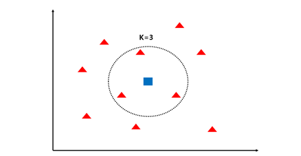

# Music-Genre-Classification-and-Recommend-Web-Service

[](https://hits.seeyoufarm.com)             

## Introduction

> 본 프로젝트는 ML을 이용한 음악 장르 분류 및 추천 웹서비스 입니다. \
음악 장르 분류는 https://github.com/boooruim/Music-Genre-Classification-Using-GTZAN
에서 구현한 모델을 이용하였습니다.

>This project is a web service for music genre classification and recommendation.\
For music genre classification, a model implemented by https://github.com/boooruim/Music-Genre-Classification-Using-GTZAN was used.

---
- ### Accuracy of the Music Genre Classification Model
    <div align="center">
        
    </div>

    음악 장르 분류 모델의 Accuracy는 100 Epoch 기준으로 0.88을 달성하였습니다.

    Accuracy in the music genre classification model achieved 0.88 based on 100 Epoch.

---
- ### Music Recommend
    <div align="center">
        
    </div>

    음악 추천은 Chromagram을 통해서 이루어집니다.\
    Chromagram은 음악의 화음과 음계를 나타내는 정보로써,
    입력된 음악의 Chromagram을 추출하여 저장소에 저장된 음악의 Chromagram들과 유사도를 측정합니다. \
    이를 통해 입력 음악과 가장 유사한 특성을 가진 음악 3개를 추천합니다.

    Music recommendations are made through Chromagram.\
    Chromagram is information representing the chord and scale of music, which extracts the chromagram of the input music and measures the similarity with the chromagram of the music stored in the storage.\
    With this, we recommend three music that have the most similar characteristics to input music.


    <div align="center">
        
    </div>

    Chromagram 사이의 유사도 측정은 k-NN 알고리즘을 이용합니다.\
    k=3으로써 입력된 Chromagram과 가장 가까운 Chromagram을 3개 찾습니다.

    Similarity measurements between Chromagrams use the k-NN algorithm.\
    Find the 3 closest Chromagrams to the Chromagrams entered with k=3.

---
- ### User Interface
    <div align="center">
        
    </div>

    브라우저를 통해 사용자가 음악을 업로드 하면 분류된 장르를 보여주고 10개의 장르에 대한 예측 비율을 보여주고 가장 비슷한 음악 3개를 추천해줍니다.

    When a user uploads music through a browser, it shows the categorized genres, shows the predicted rate for 10 genres, and recommends the three most similar music.

## Getting Started Guide

- ### Requirements

    For building and running the application you need:

    - Docker Image(deepo)
    - Python 3.8.10
    - librosa 0.10.1
    - Flask 3.0.0
    - Jinja2 3.1.2

- ### Installation

    - Dataset Download link: 
    https://www.kaggle.com/datasets/andradaolteanu/gtzan-dataset-music-genre-classification

    - ```$ git clone https://github.com/boooruim/Music-Genre-Classification-and-Recommend-Web-Service.git ```

    - ```$ docker pull ufoym/deepo```

## Running the Application

- Once the image(deepo) is downloaded, run a Docker container and enter it.
- ```$ cd Music-Genre-Classification-and-Recommend-Web-Service```
- ```$ python preprocess.py ``` # Prior to running this command, please execute the preprocessing script to prepare the data.
- ```$ python main.py```

## Architecture

- ### System Structure
    <div align="center">
        
    </div>
    
- ### Directory Structure

    ```bash

    ├── Web
    │   ├── Data                    # 추천 음악을 위한 Chromagram의 저장소
    │   │   ├── blues
    │   │   ├── classical
    │   │   ├── country
    │   │   ├── disco
    │   │   ├── hiphop
    │   │   ├── jazz
    │   │   ├── metal
    │   │   ├── pop
    │   │   ├── reggae
    │   │   └── rock
    │   ├── __pycache__
    │   ├── images
    │   ├── input_data              # 업로드된 음악의 저장소
    │   │   ├── audio_files
    │   │   └── mel_files
    │   ├── ml                      # 장르 분류 모델 저장소
    │   │   └── __pycache__
    │   ├── static
    │   │   └── genres_description
    │   ├── templates               
    │   └── weight                  # 장르 분류 모델의 가중치 저장소
    └── archive                     # GTZAN 데이터셋
        ├── genres_original
        │   ├── blues
        │   ├── classical
        │   ├── country
        │   ├── disco
        │   ├── hiphop
        │   ├── jazz
        │   ├── metal
        │   ├── pop
        │   ├── reggae
        │   └── rock
        └── images_original
            ├── blues
            ├── classical
            ├── country
            ├── disco
            ├── hiphop
            ├── jazz
            ├── metal
            ├── pop
            ├── reggae
            └── rock
    ```

